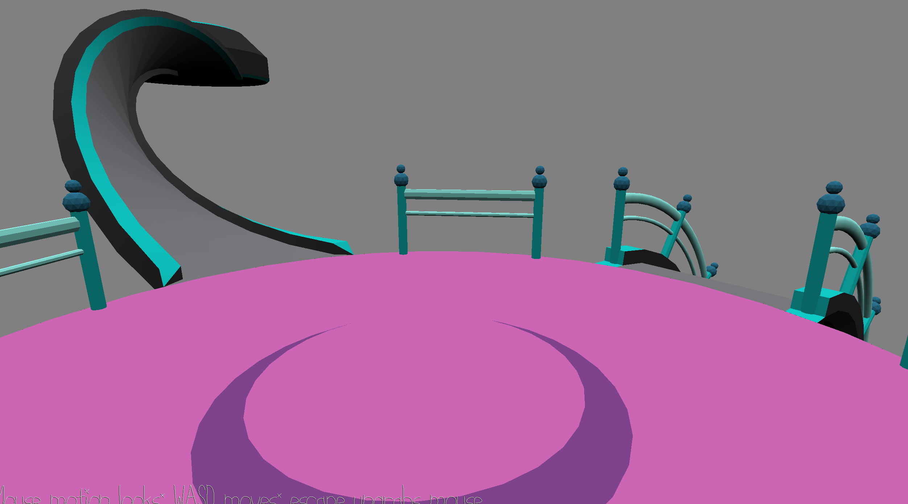

# Croquet

Author: Leah Restad

Design: My goal was to design a croquet game where you hit the ball and flowwit it throught the course, seeing how few hits you can use. I only had time to get the WalkMesh working, then I fell asleep.

Screen Shot:

How To Play:
Walk.

Sources: Listed in WalkMesh.cpp

This game was built with [NEST](NEST.md).

